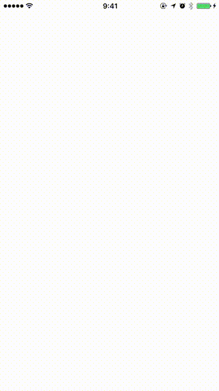
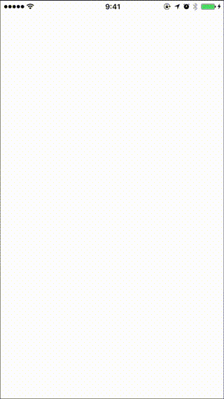

# SwiftRater

[](http://cocoapods.org/pods/SwiftRater)
[](http://cocoapods.org/pods/SwiftRater)
[](http://cocoapods.org/pods/SwiftRater)
[](https://app.bitrise.io/app/55becad13fb442f0)
[](https://codebeat.co/projects/github-com-takecian-swiftrater-master)

SwiftRater is a class that you can drop into any iPhone app that will help remind your users to review your app on the App Store/in your app.

SwiftRater is written in pure Swift.

## iOS 10.3 〜


For iOS 10.3 devices, SwiftRater uses SKStoreReviewController.

## 〜 iOS 10.2


## Requirements

iOS 8.0 or later, written in Swift.
Xcode 8.2 or later.

## Installation

### Cocoapods

SwiftRater is available through [CocoaPods](http://cocoapods.org). To install
it, simply add the following line to your Podfile:

```ruby
pod "SwiftRater"
```
### Carthage

SwiftRater is compatible with [Carthage](https://github.com/Carthage/Carthage). Add it to your `Cartfile`:

```ruby
github "takecian/SwiftRater"
```

## Usage

1.Setup SwiftRater in AppDelegate.swift. After setting up, call `SwiftRater.appLaunched()`.

```
    func application(_ application: UIApplication, didFinishLaunchingWithOptions launchOptions: [UIApplicationLaunchOptionsKey: Any]?) -> Bool {
        SwiftRater.daysUntilPrompt = 7
        SwiftRater.usesUntilPrompt = 10
        SwiftRater.significantUsesUntilPrompt = 3
        SwiftRater.daysBeforeReminding = 1
        SwiftRater.showLaterButton = true
        SwiftRater.debugMode = true
        SwiftRater.appLaunched()

        return true
    }

```

| Property      | Description           |
| :------------- |:-------------|
| daysUntilPrompt      | Shows review request if `daysUntilPrompt` days passed since first app launch. |
| usesUntilPrompt      | Shows review request if users launch more than `usesUntilPrompt` times.      |
| significantUsesUntilPrompt | Shows review request if user does significant actions more than `significantUsesUntilPrompt` |

You can set properties you want to apply.

| Property      | Description           |
| :------------- |:-------------|
| debugMode      | Shows review request every time. Default false, **need to set false when you submit app to AppStore**. |
| showLaterButton | Show Later button in review request dialong, valid for iOS10.2 or before devices.|
| daysBeforeReminding | Days until reminder popup if the user chooses `rate later`,  valid for iOS10.2 or before devices.      |

2.Call `SwiftRater.check()` in `viewDidAppear` of ViewController where you want to show review request dialog. If conditions are met, SwiftRater will show review request popup.

```
    override func viewDidAppear(_ animated: Bool) {
        super.viewDidAppear(animated)
        SwiftRater.check()
    }

```

3(Optional).For `significantUsesUntilPrompt`, you need to add `SwiftRater.incrementSignificantUsageCount` in siginificant action for your app.

```
func postComment() {
    // do something ..

	SwiftRater.incrementSignificantUsageCount()
}

```

4(Optional).Call `SwiftRater.rateApp(host:)` to let your users to review your app on the App Store/in your app directly.

```
func rateButtonDidClick(sender: UIButton) {
    // do something ..

	SwiftRater.rateApp(host: self)
}

```

## Example

This example states that the rating request is only shown when the app has been launched 5 times and after 7 days, remind 5 days after if later selected.

```
SwiftRater.daysUntilPrompt = 7
SwiftRater.usesUntilPrompt = 5
SwiftRater.daysBeforeReminding = 5
SwiftRater.appLaunched()
```

If you wanted to show the request after 5 days only and remind 7 days after if later selected, you can set the following:

```
SwiftRater.daysUntilPrompt = 5
SwiftRater.daysBeforeReminding = 7
SwiftRater.appLaunched()
```

## Customize text

You can customize text in review request dialog for iOS10.2 or before devices. Set text in following properties.
- SwiftRater.alertTitle
- SwiftRater.alertMessage
- SwiftRater.alertCancelTitle
- SwiftRater.alertRateTitle
- SwiftRater.alertRateLaterTitle
- SwiftRater.appName

## Country code

If your app is only avaiable for some coutnries, please add country code at Setup phase.

```
    func application(_ application: UIApplication, didFinishLaunchingWithOptions launchOptions: [UIApplicationLaunchOptionsKey: Any]?) -> Bool {
        SwiftRater.daysUntilPrompt = 7
        SwiftRater.usesUntilPrompt = 10

        SwiftRater.countryCode = "fr"

        SwiftRater.debugMode = true
        SwiftRater.appLaunched()
        return true
    }
```

## Demo

You can find Demo app in this repo.

## Author

takecian, takecian@gmail.com

## License

SwiftRater is available under the MIT license. See the LICENSE file for more info.
