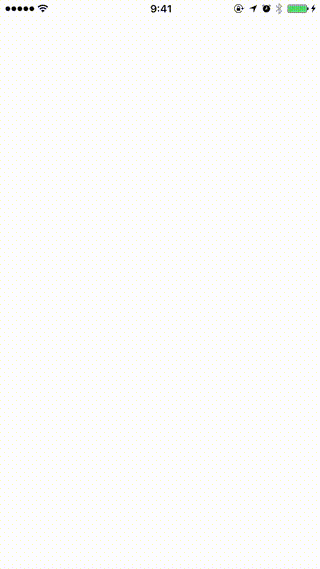
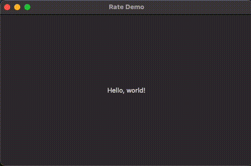

# SwiftRater

[](http://cocoapods.org/pods/SwiftRater)
[](http://cocoapods.org/pods/SwiftRater)
[](https://swiftpackageindex.com/takecian/SwiftRater)
[](https://swiftpackageindex.com/takecian/SwiftRater)
[](https://app.bitrise.io/app/55becad13fb442f0)
[](https://codebeat.co/projects/github-com-takecian-swiftrater-master)

SwiftRater is a class that you can drop into any iPhone app that will help remind your users to review your app on the App Store/in your app.

SwiftRater is written in pure Swift.

## iOS


## macOS


## Requirements

- iOS 13.0 or macOS 10.15 or later
- Swift Package Manager: Swift 5.10 or later (Swift 5 language mode by default)
- Xcode project / CocoaPods: Xcode 16 or later, using Swift 6 language mode

The SwiftRater API is main-actor isolated. Configure it and call its methods on the main actor; from other asynchronous contexts, use `await MainActor.run { ... }`.

## Installation

### SPM

Open your project setting and navigate to "Package dependencies" tab. Put "https://github.com/takecian/SwiftRater".

### Cocoapods

SwiftRater is available through [CocoaPods](http://cocoapods.org). To install
it, simply add the following line to your Podfile:

```ruby
pod "SwiftRater"
```
### Carthage

SwiftRater is compatible with [Carthage](https://github.com/Carthage/Carthage). Add it to your `Cartfile`:

```ruby
github "takecian/SwiftRater"
```

## Usage

1.Setup SwiftRater in AppDelegate.swift. After setting up, call `SwiftRater.appLaunched()`.

```
    func application(_ application: UIApplication, didFinishLaunchingWithOptions launchOptions: [UIApplicationLaunchOptionsKey: Any]?) -> Bool {
        SwiftRater.daysUntilPrompt = 7
        SwiftRater.usesUntilPrompt = 10
        SwiftRater.significantUsesUntilPrompt = 3
        SwiftRater.daysBeforeReminding = 1
        SwiftRater.showLaterButton = true
        SwiftRater.debugMode = true
        SwiftRater.appLaunched()

        return true
    }

```

If you are using SwiftUI, create AppDelegate class that inherits UIApplicationDelegate and
configure SwiftRater there. (Thanks [@markgravity](https://github.com/markgravity) for the suggetion)

```
@main
struct YourApp: App {
    @UIApplicationDelegateAdaptor(AppDelegate.self) var appDelegate

    var body: some Scene {
        WindowGroup {
            ContentView()
        }
    }
}

class AppDelegate: NSObject, UIApplicationDelegate {
    func application(_ application: UIApplication, didFinishLaunchingWithOptions launchOptions: [UIApplication.LaunchOptionsKey : Any]? = nil) -> Bool {
        SwiftRater.daysUntilPrompt = 7
        SwiftRater.usesUntilPrompt = 10
        SwiftRater.significantUsesUntilPrompt = 3
        SwiftRater.daysBeforeReminding = 1
        SwiftRater.showLaterButton = true
        SwiftRater.debugMode = true
        SwiftRater.appLaunched()
        return true
    }
}
```

| Property      | Description           |
| :------------- |:-------------|
| daysUntilPrompt      | Shows review request if `daysUntilPrompt` days passed since first app launch. |
| usesUntilPrompt      | Shows review request if users launch more than `usesUntilPrompt` times.      |
| significantUsesUntilPrompt | Shows review request if user does significant actions more than `significantUsesUntilPrompt` |

Set only the criteria you want to apply. A value of `-1` (the default) disables a criterion. `.all` requires every configured criterion; `.any` requires at least one. Without configured criteria or a due reminder, automatic prompts remain disabled unless `debugMode` is enabled.

| Property      | Description           |
| :------------- |:-------------|
| debugMode      | Shows review request every time. Default false, **need to set false when you submit app to AppStore**. |
| conditionsMetMode | Possible values: `.any`, `.all` (default)<br /> Setting this to `.any` allows the prompt to be shown **when any one or more of your criteria have been met**.  |
| showLaterButton | Show the Later button in the custom review dialog (`useStoreKitIfAvailable = false` or `rateApp(host:)`).|
| daysBeforeReminding | Days until the custom dialog may be shown again after the user chooses `rate later`.      |

2.Call `SwiftRater.check(host: self)` in `viewDidAppear` of the view controller where you want to request a review. Passing the visible host ensures that multi-window iOS apps use the correct scene. On iOS 14 and later, a detached or backgrounded host does not consume the request, so you can retry when it becomes visible.

`check` returns whether the eligibility conditions were met, not whether a dialog appeared. StoreKit decides whether to display its system prompt. SwiftRater uses `AppStore.requestReview(in:)` on iOS 18 / macOS 15 and later when built with Xcode 16 or later, and retains StoreKit fallbacks for older systems.

```
    override func viewDidAppear(_ animated: Bool) {
        super.viewDidAppear(animated)
        SwiftRater.check(host: self)
    }

```

3(Optional).For `significantUsesUntilPrompt`, you need to add `SwiftRater.incrementSignificantUsageCount` in siginificant action for your app.

```
func postComment() {
    // do something ..

	SwiftRater.incrementSignificantUsageCount()
}

```

4(Optional).Call `SwiftRater.rateApp(host:)` to let your users to review your app on the App Store/in your app directly.

```
func rateButtonDidClick(sender: UIButton) {
    // do something ..

	SwiftRater.rateApp(host: self)
}

```

## Example

This example states that the rating request is only shown when the app has been launched 5 times and after 7 days, remind 5 days after if later selected.

```
SwiftRater.daysUntilPrompt = 7
SwiftRater.usesUntilPrompt = 5
SwiftRater.daysBeforeReminding = 5
SwiftRater.appLaunched()
```

If you wanted to show the request after 5 days only and remind 7 days after if later selected, you can set the following:

```
SwiftRater.daysUntilPrompt = 5
SwiftRater.daysBeforeReminding = 7
SwiftRater.appLaunched()
```

If you wanted to show the request after a user performs 10 significant actions before 5 days or 5 uses have passed:

```
SwiftRater.conditionsMetMode = .any
SwiftRater.daysUntilPrompt = 5
SwiftRater.usesUntilPrompt = 5
SwiftRater.significantUsesUntilPrompt = 10
```

## Customize text

You can customize text in the custom review dialog (`useStoreKitIfAvailable = false` or `rateApp(host:)`). StoreKit controls its own prompt text. Set the following properties.
- SwiftRater.alertTitle
- SwiftRater.alertMessage
- SwiftRater.alertCancelTitle
- SwiftRater.alertRateTitle
- SwiftRater.alertRateLaterTitle
- SwiftRater.appName

## Country code

If your app is only avaiable for some coutnries, please add country code at Setup phase.

```
    func application(_ application: UIApplication, didFinishLaunchingWithOptions launchOptions: [UIApplicationLaunchOptionsKey: Any]?) -> Bool {
        SwiftRater.daysUntilPrompt = 7
        SwiftRater.usesUntilPrompt = 10

        SwiftRater.countryCode = "fr"

        SwiftRater.debugMode = true
        SwiftRater.appLaunched()
        return true
    }
```

## App ID

Optional, you can set App ID explicitly. If not, SwiftRater will get App ID from appstore by bundle ID.

```
    func application(_ application: UIApplication, didFinishLaunchingWithOptions launchOptions: [UIApplicationLaunchOptionsKey: Any]?) -> Bool {
        SwiftRater.daysUntilPrompt = 7
        SwiftRater.usesUntilPrompt = 10

        SwiftRater.appID = "1104775712"

        SwiftRater.debugMode = true
        SwiftRater.appLaunched()
        return true
    }
```
## Demo

You can find Demo app in this repo.

## Development

On a Mac with Xcode selected, run the package tests:

```sh
swift test
swift test -Xswiftc -swift-version -Xswiftc 6
```

Build the iOS framework without signing:

```sh
xcodebuild -project SwiftRater.xcodeproj -scheme SwiftRater \
  -destination 'generic/platform=iOS Simulator' CODE_SIGNING_ALLOWED=NO build
```

To run the iOS tests, list destinations with `xcodebuild -project SwiftRater.xcodeproj -scheme SwiftRater -showdestinations`, then run:

```sh
xcodebuild -project SwiftRater.xcodeproj -scheme SwiftRater \
  -destination 'platform=iOS Simulator,id=<simulator-UDID>' \
  CODE_SIGNING_ALLOWED=NO test
```

The tests use separate UserDefaults suites and do not open review dialogs or contact the App Store. Apple SDKs are required; Linux `swift test` is not supported. See [AGENTS.md](AGENTS.md) for repository guidance.

## Author

takecian, takecian@gmail.com

## License

SwiftRater is available under the MIT license. See the LICENSE file for more info.
